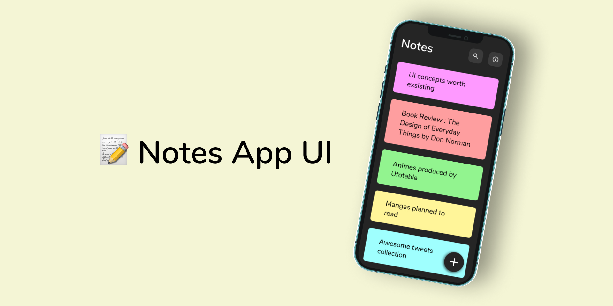
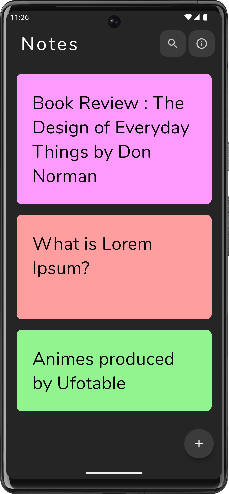
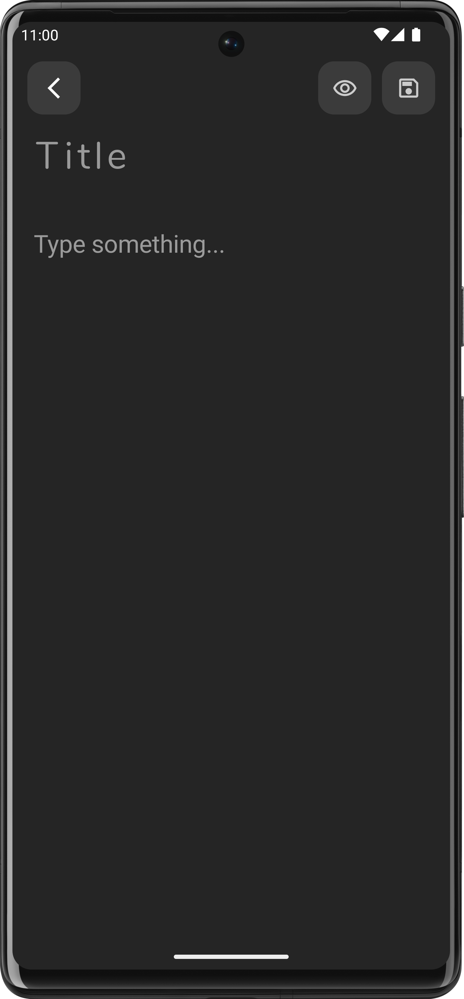
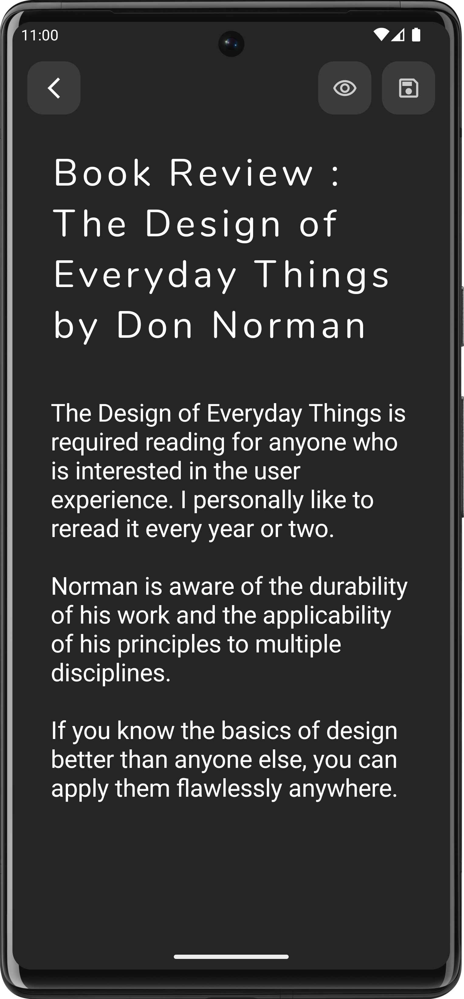
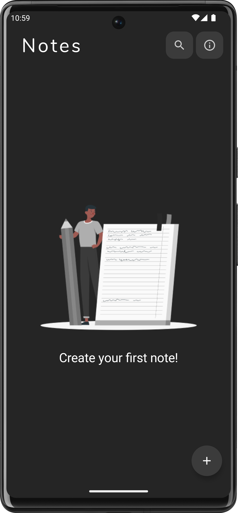

# Note App

## About Project:

Note CRUD App Design by
https://www.figma.com/community/file/1014161465589596715

## Project Features:

- MVVM Architecture
- Jetpack Compose
- Clean Architecture
- SOLID
- Coroutines
- Dagger Hilt dependency injection
- Flows
- StateFlow

## Screenshots

<table>
<tr>
 <td></td>
 <td></td>
 <td></td>
</tr>
<tr>
 <td></td>
</tr>
</table>

